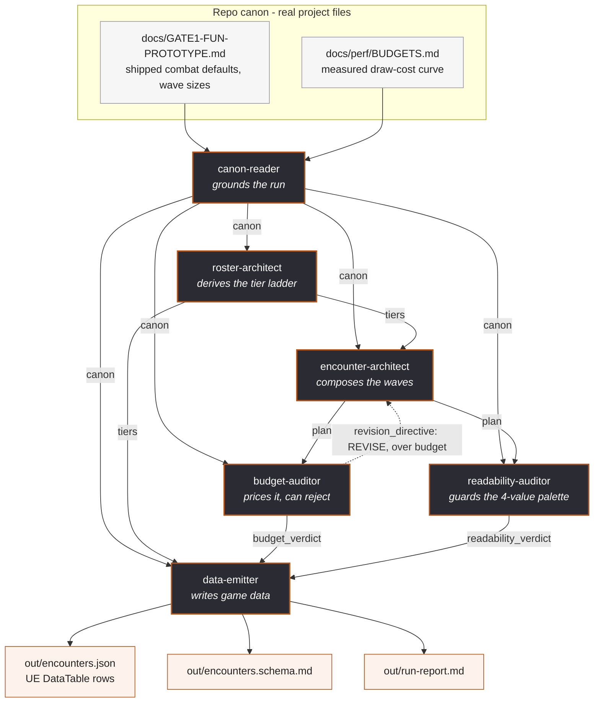

# Kindled — Encounter Design Crew

**Assignment #3 — Build an Agent Crew** · Multi-Agent AI for Game Development
Aaron Low · 27 July 2026

---

## The game

**Kindled** is a single-player top-down roguelike built in Unreal Engine 5.8. You carry
the only fire in a pitch-dark world, and an army gathers in your light because outside it
they die. You command that army — three to ten units early, hundreds by late run — through
four broad stances rather than unit selection. The design document is
[`docs/ASSIGNMENT-02-FINAL-GDD.md`](../docs/ASSIGNMENT-02-FINAL-GDD.md); the playable
prototype is in this same repository.

The game's defining constraint is **entity count against frame budget**. Every enemy on
screen costs draw time, and the project has a measured cost curve for exactly that
(`docs/perf/BUDGETS.md`). Encounter design in Kindled is therefore not a taste question —
it is a budget question with a hard ceiling at 16.6 ms per frame.

## What this crew produces

Six agents turn the project's *measured* canon into a **DataTable-ready encounter
specification** — the wave composition for one floor of the vertical slice, priced against
the real frame budget and checked against the locked 4-value palette.

Concretely, one run writes:

| Artifact | What it is |
|---|---|
| `out/encounters.json` | Flat, typed rows that import directly as an Unreal **DataTable** — the game data the encounter actually ships as |
| `out/encounters.schema.md` | The column contract for that JSON, plus the audit state at generation |
| `out/run-report.md` | Every agent's role, the encounter table, the budget verdict, and the full negotiation transcript |

This is game-ready output, not a document about game-ready output: `encounters.json` has a
unique `Name` row key, scalar columns only and no nesting, which is exactly what Unreal's
DataTable importer requires — the same contract the project's other data files follow.

## Running it

```bash
py crew/kindled_crew.py              # design floor 1
py crew/kindled_crew.py --floor 3    # floor 3 — forces a real negotiation
py crew/kindled_crew.py --verbose    # show every blackboard read and write
py crew/kindled_crew.py --drop budget-auditor   # prove no agent is removable
```

**No dependencies.** Python 3.8+ standard library only — no CrewAI, no network calls, no
API key, nothing to install. That is a deliberate reliability decision: the assignment
grades whether the crew *runs*, and a crew that needs a live API key is a crew that can
fail at grading time for reasons that have nothing to do with its design. The assignment
permits "CrewAI **or raw orchestration code**"; this is the latter, taken seriously.

## Architecture



The dashed edge is the one that matters: **`budget-auditor` can send the plan back**, and
the crew loops until it converges. That is the difference between a pipeline and a crew.

## The agents

Each agent declares the blackboard keys it may read and write. The `Blackboard` class
*enforces* those declarations at runtime — an agent that touches an undeclared key raises
`ContractViolation`. This is why the dependency graph above is real rather than a drawing.

| Agent | Input | Output | What it does |
|---|---|---|---|
| **canon-reader** | repo markdown | `canon` | Parses `GATE1-FUN-PROTOTYPE.md` and `BUDGETS.md` for the shipped wave sizes, the retinue baseline, and the measured draw-cost curve. Nothing downstream is allowed to invent a number. |
| **roster-architect** | `canon` | `tiers` | Derives the fodder → soldier → elite → boss ladder as **multipliers over the measured baseline**, and prices each tier in encounter-budget points. |
| **encounter-architect** | `canon`, `tiers`, `revision_directive` | `plan` | Composes the three waves — how many of which tier, spawn mode, breather length — and **redesigns when an auditor rejects**. |
| **budget-auditor** | `canon`, `plan` | `budget_verdict`, `revision_directive` | Projects peak concurrent entities onto the measured cost curve by interpolation. Returns PASS, or REVISE with a directive naming exactly how many bodies are affordable. |
| **readability-auditor** | `canon`, `plan` | `readability_verdict` | Checks each wave's distinct enemy types against the free palette values, so the player can still parse the fight. Flags waves that must be carried by silhouette rather than value. |
| **data-emitter** | `canon`, `tiers`, `plan`, both verdicts | the three files | Flattens the approved plan into DataTable rows, writes the schema and the run report, and **refuses to emit an unaudited or over-budget encounter**. |

### No agent can be removed

The rubric asks whether any agent could be dropped without breaking the pipeline. This
crew answers that with a flag rather than a promise:

```
$ py crew/kindled_crew.py --drop roster-architect

[canon-reader]
   - read 2 canon source(s): docs/GATE1-FUN-PROTOTYPE.md, docs/perf/BUDGETS.md

--- negotiation round 1 ---
[encounter-architect]

!!!!!!!!!!!!!!!!!!!!!!!!!!!!!!!!!!!!!!!!!!!!!!!!!!!!!!!!!!!!!!!!!!!!!!!!!!
PIPELINE BROKEN - encounter-architect needs 'tiers', but no agent has
produced it. An upstream agent is missing from the crew - the pipeline
cannot proceed.
!!!!!!!!!!!!!!!!!!!!!!!!!!!!!!!!!!!!!!!!!!!!!!!!!!!!!!!!!!!!!!!!!!!!!!!!!!
```

Every agent fails this way, at a different point, for a different missing artifact.

## What a real run found

The crew is not a demonstration that prints a pre-written answer — it does arithmetic
against measured data and reaches conclusions the author did not hand it.

**Floor 1** passes comfortably. The shipped Gate-1 wave structure (250 / 450 / 700 brood
plus a 120-unit retinue cap) peaks at **821 concurrent entities ≈ 11.12 ms**, leaving
5.48 ms of headroom against the 16.6 ms budget.

**Floor 3 does not.** At the intended escalated density it peaks at **1,871 entities ≈
37.29 ms — 2.3× over budget.** The budget-auditor rejects it, tells the architect only 956
bodies are affordable, and the two converge over three rounds on a floor that fits with
zero headroom:

```
--- negotiation round 1 ---
[encounter-architect]  composed W3: 1751 bodies (4155pts)
[budget-auditor]       REVISE - peak 1871 entities ~ 37.29ms, over budget by
                       20.69ms; only 956 bodies are affordable, sending back
--- negotiation round 2 ---
[encounter-architect]  revising; re-scaling to x1.36 of the shipped wave sizes
[budget-auditor]       REVISE - peak 1077 entities ~ 16.62ms, over by 0.02ms
--- negotiation round 3 ---
[budget-auditor]       PASS - peak 1076 entities ~ 16.60ms (0.00ms headroom)
```

That is a genuine design finding for Kindled: **the escalating-density promise in the
vertical slice cannot be paid for by the current renderer.** It agrees with the project's
independent conclusion that the debug-box renderer cannot hold the entity gate — reached
here from the other direction, by asking what the encounter can afford rather than what
the renderer costs.

The readability-auditor separately reports **CROWDED** on the boss wave: four distinct
enemy types against two free palette values, once the lit floor and the retinue have taken
theirs. Its verdict is recorded in the emitted schema, so the art direction inherits a
stated constraint rather than a surprise.

## Honest limits

- **The agents reason deterministically.** They read files, interpolate a measured curve,
  apply design rules and negotiate — they do not call a language model. The assignment
  permits raw orchestration and this crew uses that permission deliberately, for the
  reliability reason given above.
- **The cost curve is single-client and measured on the debug renderer.** When the Niagara
  sprite path gets a baseline, `BUDGETS.md` changes and every number this crew produces
  changes with it — which is the point of parsing the file rather than hardcoding it.
- **Tier multipliers are authored, not derived.** `roster-architect` encodes a designer's
  ladder; only the baseline it scales is measured.
